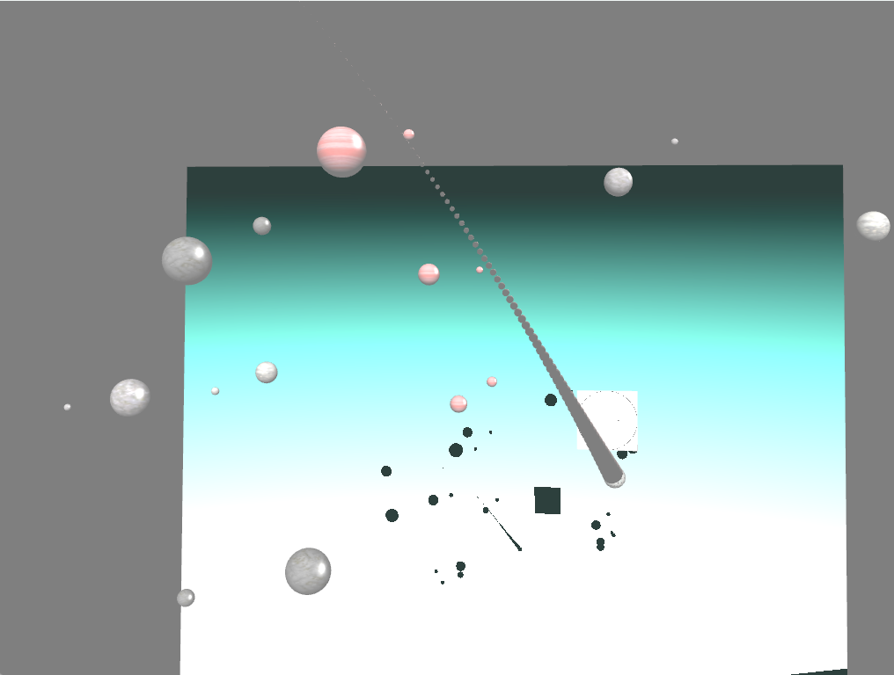
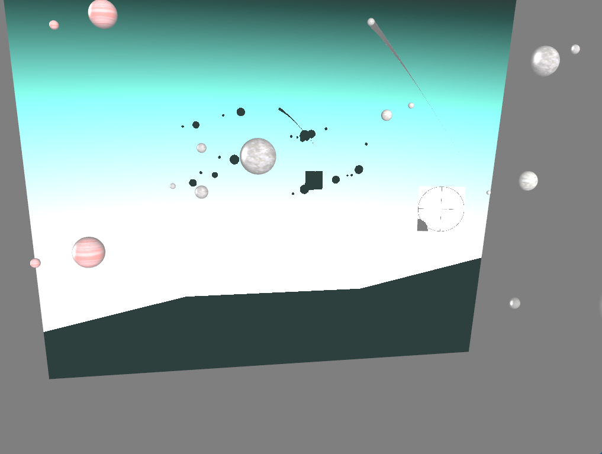
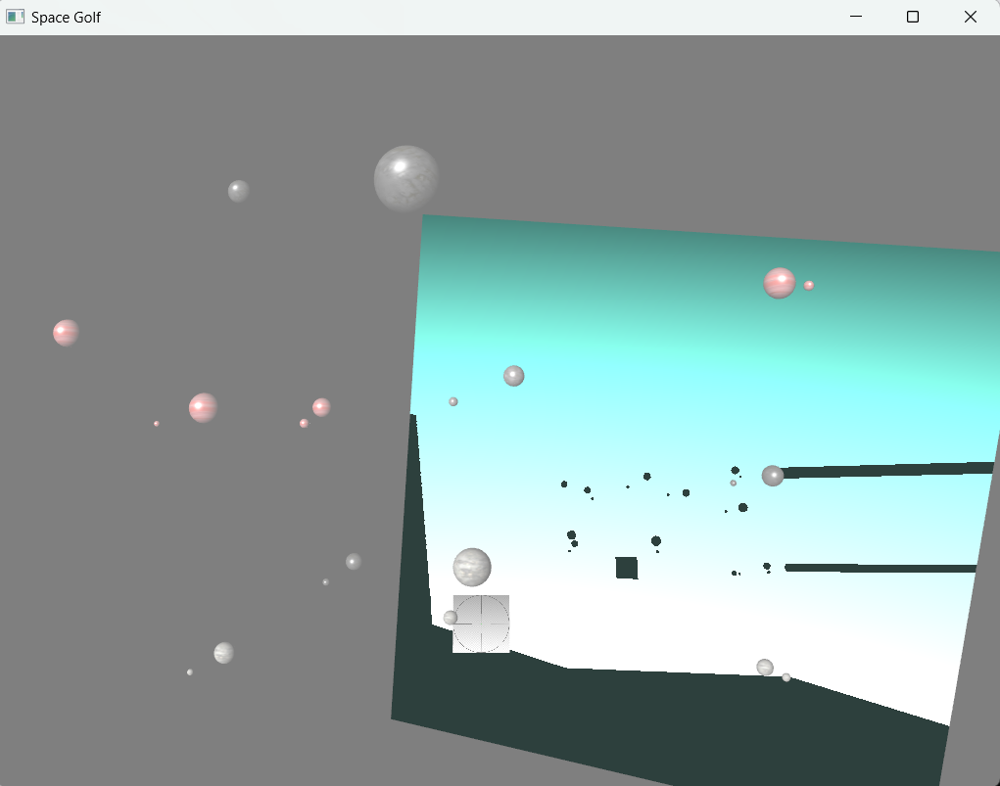

# Space Golf

**A 3D physics game in space, built in C++ and OpenGL.**

Throw a ball through a field of planets and moons and try to hit the target. Every celestial body pulls on the ball with Newtonian gravity, so each shot curves differently. A particle trail follows the ball, and a movable directional light casts real-time shadows onto a projection plane that turns to face it.

Solo project for the *Graphics and Virtual Reality* course, University of Patras (January 2023).

## Features

- **Newtonian gravity:** the force on the ball is the sum of the attraction of every planet and moon (proportional to mass, inversely proportional to the squared distance), integrated each frame with a rigid-body solver.
- **Gameplay:** launch the ball, watch its path bend around the celestial bodies, detect collisions with planets and hits on the target, pause and resume.
- **Particle trail:** a particle emitter attached to the ball draws its trajectory.
- **Directional lighting and shadow mapping:** a depth pass renders the scene from the light; shadows are cast onto a projection plane that rotates dynamically to stay oriented towards the light as you move it.
- **Textured 3D scene:** planets and moons drawn with instanced rendering and rock textures (diffuse and specular maps).
- **Free camera:** move around the scene and zoom in and out.

| Target | Shadows on the dynamic projection plane |
|---|---|
|  |  |

## Controls

| Key | Action |
|---|---|
| `Space` | Throw the ball |
| `P` | Pause / resume |
| `W` `A` `S` `D` | Move the camera |
| `↑` `↓` | Zoom in / out |
| `H` / `K` | Move the light along X |
| `Y` / `I` | Move the light along Y |
| `J` / `U` | Move the light along Z |
| `N` / `M` | Increase / decrease light power |
| `F1` | Show / hide the particle trail |
| `Esc` | Quit |

## Tech

C++ · OpenGL 3.3 · GLSL shaders · GLFW · GLEW · GLM · CMake

## Build

The project uses CMake. Generate a project for your compiler and build the `spacegolf` target; detailed platform instructions are in [building.md](building.md). A prebuilt Windows executable is included in `spacegolf/`.

## Credits

The build setup, the `common/` helpers (camera, model loading, particle emitter base classes) and the rigid-body integrator skeleton come from the course lab framework, based on [opengl-tutorial.org](http://www.opengl-tutorial.org/). The game itself (scene, gravity simulation, gameplay, target, shadow-casting projection plane, lighting controls and particle trail) is my own work.
